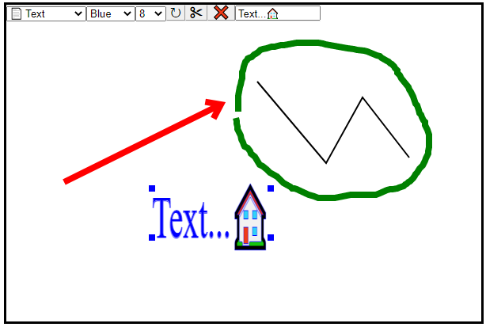

# SVG SketchPad Editor - Imbeddable jQuery Plugin
Short (under 500 lines) jQuery plugin implementation of the sketch pad/image editor


## Background
For one of my projects I needed to implement a sketch pad. Browsing Google for ideas, very quickly I came up with a canvas based sketch pad (see canvas.html in the src folder). However it was missing couple of features and I was not sure they are easy to implement on canvas platform:

- Saving drawing as image, so it can be used by external tools w/o special renderers
- Storage considerations - even PNG image would be quite large
- Ability to modify image in the future.
- Selecting existing object for fine-tuning.

So for the next iteration, I decided to base sketch pad on SVG technology (svg.html). It seems to address all the issues I had with canvas.

## Using the code
To use the code just include the editor.js file and initialize as regular jQuery plugin. 

The sample code below, creates a scratchpad area (#content) as a simple <div/> with desired dimentions. Then in jQuery document.ready function it creates a jQuery object and attaches change event handler. Inside this handler, it uses Scribble's object toText function to get drawing as svg text string and sets a value of preview #res element to that svg.

Also it gets a value of the drawing as PNG and sets the preview image to that value. Since the image load in not instantanious operation in the browser, the event handler supplied as a parameter to the function gets called when image is ready.

```
<div id="content" 
        style='position:absolute; width:600px; height:400px; left:100px; border:solid;'></div>
<script src="Editor.js"></script>
<script>
        $(document).ready(function() {
            $('#content').Scribble().change(function() {
                $('#res').html($(this).Scribble('toText', 'svg'));
                $(this).Scribble('toText', 'png', function(img) {
                    $('#img').attr('src', img);
                });
            });
        });    
</script>

<div id='res' style='border:solid;position:absolute; top:450px; left:210px;'></div>
```
There are three methods of interest here:

- onchange event - generated every time the image is changed
- toText(type, onLoad) method - a method that returns current SVG value as a string in a different formats. Possible formats:
  - svg - return value as SVG string
  - base64 - value as SVG base64 encoded
  - mix - if SVG contains unicode characters (emojii), do base64 encoding, otherwise return non-encoded value
  - png, jpeg, or any other image mime types w/o "image/" portion. When called, the return value is base64 encoded value. The image will be returned in the OnLoad method (required here)
- fromText(val) - loads a value of the editor with provided SVG string generated by toText() function above. If container element has hidden <textarea/> as a child, then the value of this textarea will be used as initial value for an editor. If this textarea is not found, the empty hidden one will be created. The text area will be updated with SVG content any time there is a change. This is a trick I use to pass values between the browser and back-end ASP.NET WebForms app.

## Supported tools
- Line - allows for creation of line
- Rectangle - allows for creation of rectangle
- Arrow - allows for creation of arrow
- Pencil - free form drawing. Initial implementaion was to remember all the mousemove points. However that leads to squigly lines and a lot of points. So the final version draws straight line if shift is not pressed. You can press the shift key or pause for half a second to drop an anchor or hold shift while drawing to follow mosemove events.
- Text - allows for text/emojii entry.
- Image - ask for image to insert. Images can also be drag/dropped or pasted on top of drawing area
- Move - switches from object creation to move/resize mode.
- Color - change color of selected/created object
- Width - changes stroke widh of the selected/created object
- Rotation - for simplicity sake I allow only for 90 degreee rotation as a time

## Points of Interest
### Base64 encoding
It some point troubleshooting final product, I encountered and issue with emojii not properly reloadind. It took me a while to realize that my database column is varchar(max) and doesn't store unicode. Since the same database is used for other projects, instead of changing column type, I decided to encode SVG as base 64. Unfortunately the btoa function in the browser has a problem so it took some time to find a solution. You can see it out at https://developer.mozilla.org/en-US/docs/Web/API/btoa.

### SVG Loading/Compatibility
SVG is a whole languadge. I never planned to be able to support all the features defined in SVG specs, just merely to be able to load the documents that I previously created. Please don't try it with just random SVG document - it will most likely not work.
